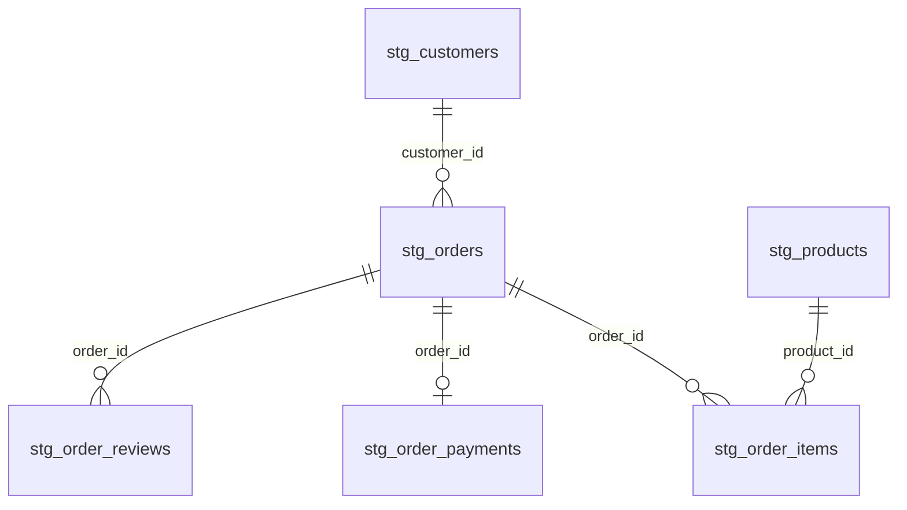

# Staging keys and cardinalities

Required staging uses explicit columns and PostgreSQL casts. T03 was tested through dbt CLI and SELECT on disposable PostgreSQL 18.6. Source timestamps are timestamp without time zone. No timezone is inferred.



| Relation | Primary key | Foreign keys and grain |
| --- | --- | --- |
| stg_customers | customer_id | Order-scoped customer record; customer_unique_id may repeat across records. |
| stg_orders | order_id | customer_id references stg_customers; eight known statuses. |
| stg_order_items | order_id, order_item_id | order_id references stg_orders; product_id references stg_products. |
| stg_products | product_id | Physical attributes support integrity checks, not ML predictors. |
| stg_order_payments | order_id | Zero or one staged summary per order; raw order_payments has many split rows. |
| stg_order_reviews | review_id | order_id references stg_orders; multiple distinct reviews per order remain. |

Payment totals become unknown if any amount is null. Favorite type uses summed value per type with alphabetical ties under C collation. Missing type stays unknown. Voucher presence is a non-null PostgreSQL boolean. Negative or non-finite amounts fail dbt validation even if positive split payments would hide them in the aggregate. Zero monetary values pass.

Reviews retain the earliest creation timestamp then smallest order ID for repeated review IDs. Null creation timestamps sort last under PostgreSQL ordering. Exact duplicates with identical ordering keys have the same declared review identity; the source's remaining comments are not predictors.

Optional geolocation, sellers and translation views remain unused by the ML predictor contract. Raw uniqueness and required source types are checked by acquisition/upload. Staging key, relationship, status, score and boolean checks run with:

```
dbt run --select path:models/staging
dbt test --select path:models/staging tag:staging --indirect-selection cautious
dbt docs generate
```

Run from ecommerce_transform with POSTGRES_* set for the chosen target. Generated target/manifest.json, catalog.json and index.html are local artifacts ignored by Git.
